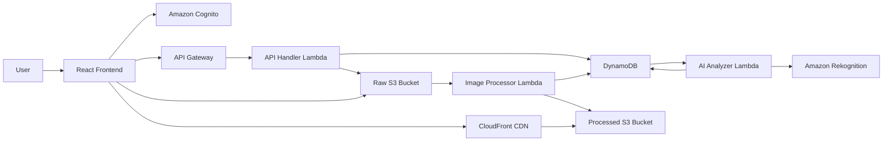

# Smart Image Platform

[English](./README.md)

Smart Image Platform là một ứng dụng lưu trữ, xử lý và phân tích ảnh bằng AI theo kiến trúc serverless trên AWS. Dự án gồm frontend React, backend AWS Lambda và hạ tầng AWS CDK.

Nền tảng cho phép người dùng upload ảnh trực tiếp lên S3, tự động tạo thumbnail/ảnh resized, phân tích nội dung bằng Amazon Rekognition, tìm kiếm theo tag AI, kiểm duyệt ảnh bị gắn cờ, công khai ảnh ra community gallery, xóa nhiều ảnh cùng lúc và tải ảnh gốc qua signed URL ngắn hạn.

## Chức Năng Chính

- Upload an toàn bằng S3 presigned PUT URL.
- Tự động tạo thumbnail và ảnh resized bằng Sharp.
- Trích xuất EXIF trong quá trình xử lý ảnh.
- Nhận diện object/scene bằng Amazon Rekognition.
- Kiểm duyệt nội dung và hàng đợi review cho admin.
- Gallery cá nhân, community gallery và tìm kiếm theo tag.
- Chuyển trạng thái ảnh giữa riêng tư/công khai.
- Xóa nhiều ảnh đã chọn cùng lúc.
- Tải ảnh gốc bằng presigned S3 GetObject URL.
- Xác thực Cognito với vai trò user/admin.
- Phân phối ảnh đã xử lý qua CloudFront.
- Quản lý hạ tầng bằng AWS CDK v2.
- Frontend có demo mode khi chưa cấu hình Cognito/API.

## Kiến Trúc



## Cấu Trúc Dự Án

```text
smart-image-platform/
├── backend/
│   ├── api-handler/       # REST API Lambda: CRUD ảnh, search, moderation, signed URL
│   ├── image-processor/   # Lambda trigger bởi S3: resize, thumbnail, EXIF
│   ├── ai-analyzer/       # Lambda trigger bởi DynamoDB Stream: Rekognition
│   ├── authorizer/        # Hỗ trợ JWT authorizer
│   └── shared/            # AWS clients và utility dùng chung
├── frontend/              # React + Vite single page app
├── infrastructure/        # AWS CDK stacks
│   ├── bin/app.ts         # Điểm vào CDK app
│   └── lib/stacks/        # Auth, storage, database, API, monitoring stacks
├── package.json           # npm workspaces root
└── tsconfig.base.json     # TypeScript config dùng chung
```

## AWS Services

- Amazon S3 để lưu ảnh gốc và ảnh đã xử lý.
- Amazon CloudFront để phân phối ảnh qua CDN.
- Amazon API Gateway cho REST API.
- AWS Lambda cho API, xử lý ảnh, phân tích AI và authorizer.
- Amazon DynamoDB cho metadata ảnh, quota, tag search và moderation state.
- Amazon Rekognition cho label và moderation label.
- Amazon Cognito cho xác thực.
- Amazon CloudWatch và X-Ray cho log, metric, tracing, dashboard và alarm.

## Yêu Cầu

- Node.js 20 trở lên.
- npm 10 trở lên.
- AWS CLI đã cấu hình credentials cho account cần deploy.
- AWS CDK v2 CLI.
- CDK environment đã bootstrap trong AWS account/region mục tiêu.

Region mặc định của dự án là `ap-southeast-1`.

## Cài Đặt

```bash
cd smart-image-platform
npm install
```

## Chạy Frontend Local

Chạy React app:

```bash
npm run --workspace=frontend dev
```

Nếu chưa cấu hình các biến dưới đây, frontend sẽ tự chạy demo mode:

```env
VITE_API_URL=https://your-api-id.execute-api.ap-southeast-1.amazonaws.com/dev
VITE_USER_POOL_ID=ap-southeast-1_xxxxxxxx
VITE_CLIENT_ID=xxxxxxxxxxxxxxxxxxxxxxxxxx
VITE_AWS_REGION=ap-southeast-1
```

Demo mode có sẵn tài khoản:

```text
user@example.com / Password123!
admin@example.com / Password123!
```

Lưu ý: demo mode lưu dữ liệu ảnh giả lập trong browser storage. Ảnh quá lớn có thể vượt quota của trình duyệt. Khi chạy AWS thật, ảnh được upload lên S3 nên không gặp giới hạn localStorage này.

## Build Và Test

Build toàn bộ workspaces:

```bash
npm run build
```

Chạy test nếu workspace có test:

```bash
npm test
```

Chạy lint frontend:

```bash
npm run --workspace=frontend lint
```

Build từng workspace:

```bash
npm run --workspace=@smart-image/api-handler build
npm run --workspace=@smart-image/image-processor build
npm run --workspace=@smart-image/ai-analyzer build
npm run --workspace=infrastructure build
npm run --workspace=frontend build
```

## Deploy

Bootstrap CDK một lần cho mỗi account/region:

```bash
npx cdk bootstrap aws://ACCOUNT_ID/ap-southeast-1
```

Deploy staging:

```bash
cd infrastructure
npm run deploy:staging
```

Deploy production:

```bash
cd infrastructure
npm run deploy:production
```

Một số lệnh CDK hữu ích:

```bash
npm run --workspace=infrastructure synth
npm run --workspace=infrastructure diff
npm run --workspace=infrastructure deploy
```

Sau khi deploy, lấy API Gateway URL, Cognito User Pool ID, Cognito Client ID và AWS region để cấu hình biến môi trường cho frontend.

## API Endpoints

Tất cả endpoint ảnh và admin cần Cognito JWT trong header `Authorization: Bearer <token>`.

| Method | Path | Mô tả |
| --- | --- | --- |
| `POST` | `/v1/images/presigned-url` | Tạo metadata ảnh và trả về presigned S3 upload URL. |
| `GET` | `/v1/images` | Lấy danh sách ảnh của user đang đăng nhập. |
| `GET` | `/v1/images/public` | Lấy ảnh công khai, an toàn, đã xử lý xong cho community gallery. |
| `GET` | `/v1/images/search?tag=TagName` | Tìm ảnh user được phép xem theo tag AI. |
| `GET` | `/v1/images/{imageId}` | Lấy chi tiết ảnh, AI tags, EXIF và trạng thái. |
| `PATCH` | `/v1/images/{imageId}` | Cập nhật metadata ảnh, ví dụ visibility. |
| `DELETE` | `/v1/images/{imageId}` | Xóa một ảnh và các object S3 liên quan. |
| `DELETE` | `/v1/images/bulk` | Xóa nhiều ảnh thuộc user hiện tại. |
| `GET` | `/v1/images/{imageId}/download` | Trả về signed URL ngắn hạn để tải ảnh gốc. |
| `GET` | `/v1/admin/moderation` | Lấy danh sách ảnh trong hàng đợi kiểm duyệt. Chỉ admin. |
| `POST` | `/v1/admin/moderation/{imageId}` | Approve/reject ảnh bị gắn cờ. Chỉ admin. |

## Luồng Xử Lý Ảnh

1. Frontend gọi `/v1/images/presigned-url`.
2. API Handler tạo record DynamoDB với trạng thái `UPLOADING` và trả về signed S3 URL.
3. Frontend upload file gốc trực tiếp lên raw S3 bucket.
4. S3 object-created event kích hoạt Image Processor Lambda.
5. Processor tạo thumbnail/resized asset, trích xuất metadata, ghi ảnh đã xử lý lên S3 và cập nhật DynamoDB.
6. DynamoDB Streams kích hoạt AI Analyzer Lambda.
7. Analyzer gọi Rekognition, lưu AI tags/moderation labels và cập nhật trạng thái cuối.
8. Frontend đọc metadata qua API Gateway và hiển thị ảnh bằng CloudFront URL.

## Ghi Chú Data Model

Bảng DynamoDB chính dùng single-table design:

```text
PK = USER#<userId>
SK = IMG#<timestamp>#<imageId>
```

Indexes:

- `GSI1-TagIndex` phục vụ tìm kiếm theo tag.
- `GSI2-ModerationIndex` phục vụ hàng đợi moderation.

Endpoint public gallery hiện dùng DynamoDB scan và filter theo `visibility`, `moderationStatus`, `status`. Cách này ổn cho dữ liệu nhỏ. Nếu dùng production với nhiều ảnh công khai, nên thêm GSI riêng cho ảnh public/safe/completed.

## Ghi Chú Bảo Mật

- S3 buckets chặn public access và bật encryption.
- Ảnh đã xử lý được phân phối qua CloudFront.
- Upload/download dùng signed URL ngắn hạn.
- API routes yêu cầu Cognito authentication.
- Admin moderation routes kiểm tra role admin ở backend.
- Search results được filter để không lộ ảnh private của user khác.
- Lambda permissions được giới hạn theo resource mà từng function cần.

## License

MIT
