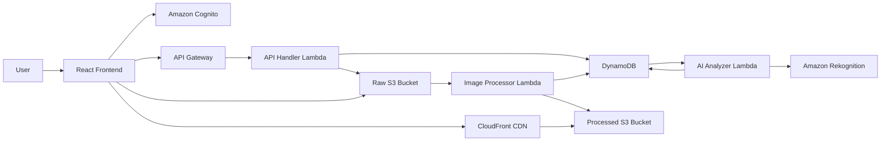

# Smart Image Platform

[Tieng Viet](./README.vi.md)

Smart Image Platform is a serverless image storage, processing, and AI analysis application built on AWS. It includes a React frontend, AWS Lambda backend services, and AWS CDK infrastructure.

The platform lets users upload images directly to S3, process thumbnails and resized images automatically, analyze content with Amazon Rekognition, search by AI tags, moderate flagged images, publish images to a community gallery, bulk delete images, and download original files through short-lived signed URLs.

## Main Features

- Secure direct upload with S3 presigned PUT URLs.
- Automatic thumbnail and resized image generation with Sharp.
- EXIF extraction during image processing.
- AI object and scene labeling with Amazon Rekognition.
- Content moderation with an admin review queue.
- Personal gallery, public community gallery, and tag search.
- Private/public visibility controls per image.
- Bulk delete for selected images.
- Original image download through presigned S3 GetObject URLs.
- Cognito authentication with user/admin role support.
- CloudFront delivery for processed image assets.
- Infrastructure as Code with AWS CDK v2.
- Demo mode in the frontend when Cognito/API environment variables are not configured.

## Architecture



## Project Structure

```text
smart-image-platform/
├── backend/
│   ├── api-handler/       # REST API Lambda: image CRUD, search, moderation, signed URLs
│   ├── image-processor/   # S3-triggered Lambda: resize, thumbnail, EXIF
│   ├── ai-analyzer/       # DynamoDB Stream Lambda: Rekognition labels and moderation
│   ├── authorizer/        # JWT authorizer support
│   └── shared/            # Shared AWS clients and utilities
├── frontend/              # React + Vite single page app
├── infrastructure/        # AWS CDK stacks
│   ├── bin/app.ts         # CDK app entry point
│   └── lib/stacks/        # Auth, storage, database, API, monitoring stacks
├── package.json           # npm workspaces root
└── tsconfig.base.json     # Shared TypeScript config
```

## AWS Services

- Amazon S3 for raw and processed image storage.
- Amazon CloudFront for CDN delivery.
- Amazon API Gateway for the REST API.
- AWS Lambda for API, processing, analysis, and authorization logic.
- Amazon DynamoDB for image metadata, quotas, tag search, and moderation state.
- Amazon Rekognition for image labels and moderation labels.
- Amazon Cognito for authentication.
- Amazon CloudWatch and X-Ray for logs, metrics, tracing, dashboards, and alarms.

## Prerequisites

- Node.js 20 or newer.
- npm 10 or newer.
- AWS CLI configured with credentials for the target account.
- AWS CDK v2 CLI.
- A bootstrapped CDK environment in the target AWS account and region.

Default region used by the project is `ap-southeast-1`.

## Installation

```bash
cd smart-image-platform
npm install
```

## Local Frontend Development

Run the React app:

```bash
npm run --workspace=frontend dev
```

If these variables are not configured, the frontend falls back to demo mode:

```env
VITE_API_URL=https://your-api-id.execute-api.ap-southeast-1.amazonaws.com/dev
VITE_USER_POOL_ID=ap-southeast-1_xxxxxxxx
VITE_CLIENT_ID=xxxxxxxxxxxxxxxxxxxxxxxxxx
VITE_AWS_REGION=ap-southeast-1
```

Demo mode uses browser storage and seeded accounts:

```text
user@example.com / Password123!
admin@example.com / Password123!
```

Note: demo mode stores mock image data in the browser. Large images can exceed browser storage quota. Real AWS mode uploads images to S3 and does not have this localStorage limitation.

## Build and Test

Build all workspaces:

```bash
npm run build
```

Run available tests:

```bash
npm test
```

Run frontend lint:

```bash
npm run --workspace=frontend lint
```

Build individual workspaces:

```bash
npm run --workspace=@smart-image/api-handler build
npm run --workspace=@smart-image/image-processor build
npm run --workspace=@smart-image/ai-analyzer build
npm run --workspace=infrastructure build
npm run --workspace=frontend build
```

## Deploy

### Step 1: Configure Environment Variables
1. Copy the `.env.example` file in the root directory to `.env`:
   ```bash
   cp .env.example .env
   ```
2. Open the `.env` file and fill in all variables:
   * **AWS Credentials**: `AWS_ACCESS_KEY_ID`, `AWS_SECRET_ACCESS_KEY` to grant CDK permissions to deploy to your AWS account.
   * **GitHub Config**: `GITHUB_REPO_URL` (your GitHub repo URL), `GITHUB_BRANCH` (the branch you want Amplify to deploy, e.g. `phuong` or `staging`), and `GITHUB_TOKEN` (your GitHub Personal Access Token with `repo` and `admin:repo_hook` scopes for webhook registration).

3. Load environment variables into the current terminal session (for PowerShell on Windows):
   ```powershell
   .\load-env.ps1
   ```

### Step 2: Bootstrap CDK (once per account/region)
```bash
npx cdk bootstrap aws://ACCOUNT_ID/ap-southeast-1
```

### Step 3: Build the Project
Build all workspaces (including backend shared, lambdas, and frontend):
```bash
npm run build
```

### Step 4: Deploy CDK to AWS
* **Deploy to staging:**
  ```powershell
  npm run --workspace=infrastructure deploy:staging
  ```
* **Deploy to production:**
  ```powershell
  npm run --workspace=infrastructure deploy:production
  ```

After successful deployment, CDK will provision all backend services and link AWS Amplify to your GitHub repository.

### Step 5: Trigger CI/CD
Make sure you have pushed all your code changes to your GitHub repository. As soon as a push event occurs on the configured branch (`GITHUB_BRANCH`), AWS Amplify will automatically pull, build, and deploy the new frontend version without requiring any manual deployment from your local machine.

## API Endpoints

All image and admin endpoints require a Cognito JWT in the `Authorization: Bearer <token>` header.

| Method | Path | Description |
| --- | --- | --- |
| `POST` | `/v1/images/presigned-url` | Create image metadata and return a presigned S3 upload URL. |
| `GET` | `/v1/images` | List images owned by the authenticated user. |
| `GET` | `/v1/images/public` | List public, safe, completed images for the community gallery. |
| `GET` | `/v1/images/search?tag=TagName` | Search visible images by AI-generated tag. |
| `GET` | `/v1/images/{imageId}` | Get image details, AI tags, EXIF data, and status. |
| `PATCH` | `/v1/images/{imageId}` | Update image metadata such as visibility. |
| `DELETE` | `/v1/images/{imageId}` | Delete one image and related S3 objects. |
| `DELETE` | `/v1/images/bulk` | Delete multiple owned images. |
| `GET` | `/v1/images/{imageId}/download` | Return a short-lived signed URL for the original file. |
| `GET` | `/v1/admin/moderation` | List images in the moderation queue. Admin only. |
| `POST` | `/v1/admin/moderation/{imageId}` | Approve or reject a flagged image. Admin only. |

## Image Processing Flow

1. The frontend requests `/v1/images/presigned-url`.
2. The API Handler creates a DynamoDB record with `UPLOADING` state and returns a signed S3 URL.
3. The frontend uploads the raw file directly to the raw S3 bucket.
4. An S3 object-created event triggers the Image Processor Lambda.
5. The processor creates thumbnail/resized assets, extracts metadata, writes processed files to S3, and updates DynamoDB.
6. DynamoDB Streams trigger the AI Analyzer Lambda.
7. The analyzer calls Rekognition, stores AI tags and moderation labels, and updates final image status.
8. The frontend reads metadata through API Gateway and displays images through CloudFront URLs.

## Data Model Notes

The main DynamoDB table uses a single-table design:

```text
PK = USER#<userId>
SK = IMG#<timestamp>#<imageId>
```

Indexes:

- `GSI1-TagIndex` supports tag-based search.
- `GSI2-ModerationIndex` supports moderation queue lookups.

The current public gallery endpoint uses a DynamoDB scan filtered by `visibility`, `moderationStatus`, and `status`. This is acceptable for small datasets. For production-scale public galleries, add a dedicated GSI for public/safe/completed images.

## Security Notes

- S3 buckets block public access and enforce encryption.
- Processed assets are delivered through CloudFront.
- Upload and download operations use short-lived signed URLs.
- API routes require Cognito authentication.
- Admin moderation routes check the admin role in the backend.
- Search results are filtered to avoid exposing private images owned by other users.
- Lambda permissions are scoped to the resources required by each function.

## License

MIT
